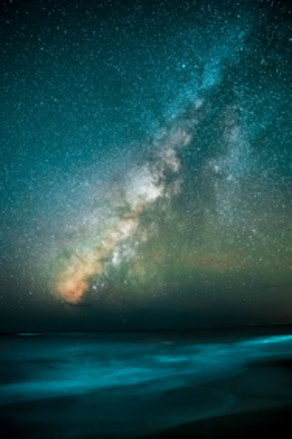
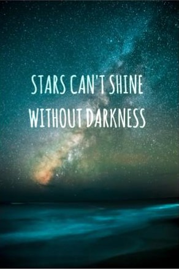

# IIT6028

### Computational Photography

by [Kate Shim](http://sit.yonsei.ac.kr/faculty/name_search.do?mode=view&userId=p8fJaumat7CBJY7SRKITeQ%3D%3D)
@ [Yonsei University](http://www.yonsei.ac.kr/sc/index.jsp)

## Web Demo

https://pjunhyuk.github.io/IIT6028/

## [HA#1](https://pjunhyuk.github.io/IIT6028/A1/web/)
#### Implement a basic image processing pipeline

1. Initials
2. Linearlization
3. Identifying the correct bayer pattern
4. White balancing
5. Demosaicing
6. Brightness adjustment and gamma correction
7. Compression

## [HA#2](https://pjunhyuk.github.io/IIT6028/A2/web/)
#### Eulerian Video Magnification

1. Initials and color transformation
2. Laplacian pyramid
3. Temporal filtering
4. Extracting the frequency band of interest
5. Image reconstruction
6. (+ Capture and motion-magnify your own video(s))

## [HA#3](https://pjunhyuk.github.io/IIT6028/A3/web/)
#### Implement poisson blending

1. Toy problem
2. Poisson blending
3. Blending with mixed gradients
4. Your own examples
